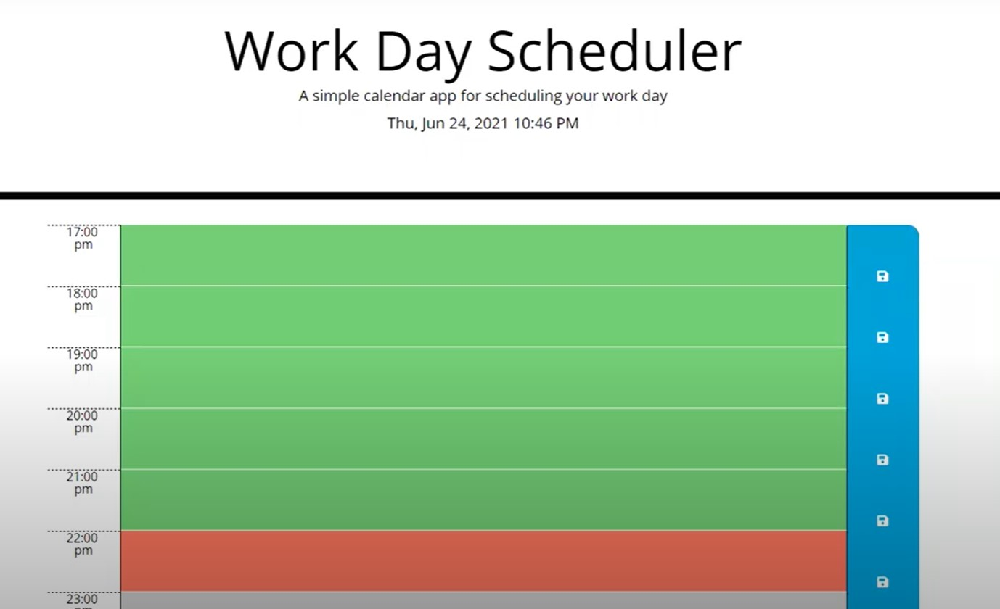

# Work Day Scheduler Starter Code

## Description
* A simple calendar application that allows a user to save events for each hour of the day. This app will run in the browser and feature dynamically updated HTML and CSS powered by jQuery.

* The starter code uses the Moment.js (Links to an external site.) library to work with date and time.

## Features

AS AN employee with a busy schedule
I WANT to add important events to a daily planner
SO THAT I can manage my time effectively
GIVEN I am using a daily planner to create a schedule
~~~
WHEN I open the planner
THEN the current day is displayed at the top of the calendar
WHEN I scroll down
THEN I am presented with time blocks for standard business hours
WHEN I view the time blocks for that day
THEN each time block is color-coded to indicate whether it is in the past, present, or future
WHEN I click into a time block
THEN I can enter an event
WHEN I click the save button for that time block
THEN the text for that event is saved in local storage
WHEN I refresh the page
THEN the saved events persist
~~~

## Mock-Up
The following animation demonstrates the application functionality:

### Link to application
https://isaiasqb.github.io/day-scheduler/

### Link to repository
https://github.com/isaiasqb/day-scheduler

## Action Plan
- Create the basic structure (blocks of standar business hours)
- Add functionality to display current time
- Add fucntionality to edit tasks
- Add functionality to save tasks
- Work on color coding depending on past, present or future
- Work on touch ups, color and fonts
